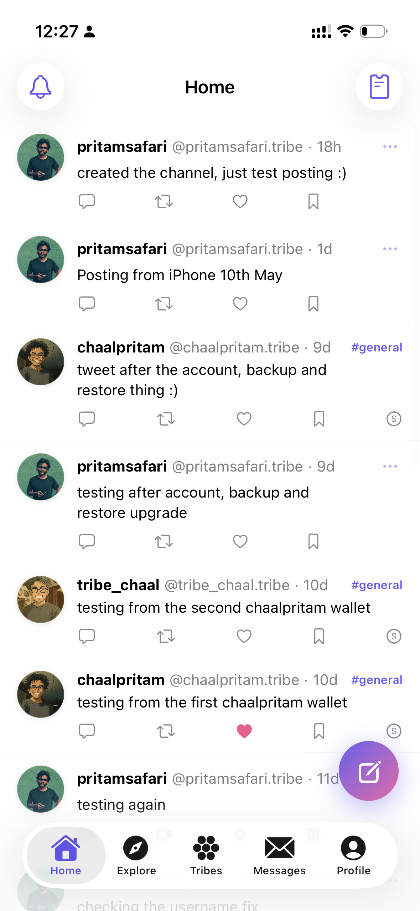

# TribeEco

**A fully-owned, open social protocol on Solana.**

## Overview

TribeEco is a decentralized social protocol built on Solana. It provides on-chain identity (TID), delegated app keys, human-readable usernames (.tribe), a social graph with an Ephemeral Rollup sequencer, hub registration for peer discovery, and off-chain storage of signed messages (tweets, reactions, DMs, channels, polls, events, tasks, crowdfunds, tips, bookmarks) with peer-to-peer gossip sync. The protocol is designed so that users fully own their identity and social data — no platform can revoke access or censor content at the infrastructure layer.

<p>
  
  
</p>


## Architecture

```
                        Users / Apps
                             |
                       tribe-sdk (TypeScript)
                       /         |          \
   tribe-twitter-app / tribeapp.wtf   tribe / tribe-twitter / tribe-insta   tribe-er-server   tribe-hub
        (web frontends)              (native iOS)         (ER sequencer)    (storage + indexing + gossip)
                \                  |                /
  ┌──────────────┴──────────────────┴──────────────┴────┐
  |                Solana Programs                       |
  |  tid-registry . app-key-registry                     |
  |  username-registry . social-graph . hub-registry     |
  └──────────────────────────────────────────────────────┘
```

See [HOW-IT-WORKS.md](./HOW-IT-WORKS.md) for a detailed walkthrough of every layer and how they connect.

## Repos

| Directory | Description |
|-----------|-------------|
| [tribe-protocol](./tribe-protocol) | Solana programs (Anchor) — 12 programs: tid-registry, app-key-registry, username-registry, social-graph w/ ER delegation, hub-registry, tip-registry, crowdfund-registry, task-registry, channel-registry, karma-registry, poll-registry, event-registry |
| [tribe-sdk](./tribe-sdk) | TypeScript SDK — DirectSolana and EphemeralRollup providers; clients for identity, tweets, DMs, profiles, channels, bookmarks, polls, events, tasks, crowdfunds, tips, search |
| [tribe-hub](./tribe-hub) | Decentralized hub — signed-message storage + Solana indexer + gossip peer sync; REST + WebSocket APIs |
| [tribe-er-server](./tribe-er-server) | Ephemeral Rollup sequencer — instant follows, batched L1 settlement every 10s |
| [tribe-twitter-app](./tribe-twitter-app) | Next.js frontend — protocol-first reference client with multi-node failover |
| [tribeapp.wtf](./tribeapp.wtf) | Consumer-facing web app + landing page at tribeapp.wtf — hyperlocal social built entirely on the protocol |
| [tribe](./tribe) | Native SwiftUI hyperlocal iOS client (`app.tribe.app`) — city/channel feeds, explore, map, tribes; ports tribeapp.wtf |
| [tribe-twitter](./tribe-twitter) | Native SwiftUI iOS client (Twitter-shaped, `app.tribe.twitter`) — full read/write against hub + ER, NaCl-box DMs, BLAKE3 + ed25519 signing |
| [tribe-insta](./tribe-insta) | Native SwiftUI iOS client (Instagram-shaped) — photo grid, stories, reels; same hub + envelope format. Hub-backed beta — see `tribe-insta/PLAN.md` |
| [tribe-core-swift](./tribe-core-swift) | Shared Swift package consumed by tribe, tribe-twitter, and tribe-insta — crypto, hub API, models. See `tribe-core-swift/MIGRATION.md` |
| [homebrew-tap](./homebrew-tap) | Homebrew formulas: `brew install tribe` (hub + ER) and `brew install tribe-twitter-app` (demo UI) |
| ~~[tribe-indexer](./tribe-indexer)~~ | **Deprecated** — Solana event indexer, merged into tribe-hub |
| ~~[tribe-tweet-server](./tribe-tweet-server)~~ | **Deprecated** — Tweet storage server, merged into tribe-hub |

## Run a Tribe Node

### macOS (Homebrew)

Works on MacBook, Mac Mini, Mac Pro (Intel or Apple Silicon).

```bash
brew tap chaalpritam/tribe

# Tracks the master branch — recommended for active development:
brew install --HEAD tribe

# Or pin to the v0.1.0 snapshot:
brew install tribe

tribe start
```

Auto-installs all dependencies (Docker, Colima, Node.js, pnpm, Solana CLI), generates a server wallet, and boots all services.

**Updating** depends on which install you picked:

```bash
brew upgrade --fetch-HEAD tribe   # for --HEAD installs
brew reinstall tribe              # for stable installs (also re-pulls master)
```

`brew upgrade tribe` alone won't update a stable install because the formula's pinned `version "0.1.0"` doesn't change between commits — `brew reinstall` forces a re-fetch.

```bash
tribe seed set ws://<SEED_IP>:4000/gossip   # connect to the network (wss:// also supported)
tribe peers                                  # verify connection
tribe network                                # show all URLs
```

### Raspberry Pi

Works on Raspberry Pi 4 (4GB+) and Raspberry Pi 5 with Raspberry Pi OS 64-bit.

**One-line install:**

```bash
curl -fsSL https://raw.githubusercontent.com/chaalpritam/TribeEco/master/deploy/raspberry-pi/setup.sh | bash
```

**Or step by step:**

```bash
git clone --recurse-submodules https://github.com/chaalpritam/TribeEco.git ~/tribe
cd ~/tribe/deploy/raspberry-pi
./setup.sh
```

After setup, connect to the network:

```bash
curl -X POST http://localhost:4000/v1/peers \
  -H "Content-Type: application/json" \
  -d '{"url": "ws://<SEED_IP>:4000/gossip"}'
```

Auto-start on boot:

```bash
sudo systemctl enable docker
crontab -e   # add: @reboot cd ~/tribe && docker compose up -d
```

### Seed Node (VPS)

The seed node is the public entry point for the network. Deploy on any VPS with a public IP (Oracle Cloud free tier, DigitalOcean, Hetzner).

```bash
ssh ubuntu@<VPS_IP>
git clone --recurse-submodules https://github.com/chaalpritam/TribeEco.git ~/tribe-seed
cd ~/tribe-seed/deploy/seed
./setup-seed.sh
```

The seed prints its gossip URL. Share it with all node operators:

```
ws://<PUBLIC_IP>:4000/gossip
```

### Docker (any platform)

```bash
git clone --recurse-submodules https://github.com/chaalpritam/TribeEco.git
cd TribeEco
docker-compose up -d        # Start hub, ER server, and databases
cd tribe-twitter-app && pnpm install && pnpm dev -p 3002   # Start frontend (optional)
```

## Build from Source

### On-chain programs

```bash
cd tribe-protocol
pnpm install
anchor build
anchor test          # full integration suite against local validator
```

### SDK

```bash
cd tribe-sdk
pnpm install
pnpm run build
```

## Devnet Deployment

All 5 programs are part of the workspace. The first four are deployed to Solana devnet; `hub-registry` is currently localnet-only as the network rolls out.

| Program | Program ID | Instructions |
|---------|------------|-------------|
| tid-registry | `4BSmJmRGQWKgioP9DG2bUuRS9U3V6soRauU7Nv6yGvHD` | 5 |
| app-key-registry | `5LtbFUeAoXWRovGpyWnRJhiCS62XsTYKVErT9kPpv4hN` | 3 |
| username-registry | `65oKjSjcGYR61ASzDYczbodz6H8TARtJyQGvb5V9y9W1` | 4 |
| social-graph | `8kKnWvbmTjWq5uPePk79RRbQMAXCszNFzHdRwUS4N74w` | 7 (incl. ER-delegated) |
| hub-registry | `HubReg1111111111111111111111111111111111111` | 4 |

The ER sequencer authority is registered on devnet with a funded server wallet.

## Key Concepts

### TID (Tribe ID)

Every user receives a unique auto-incrementing 64-bit numeric identity. Each TID has a custody address (primary wallet) and a recovery address (can reclaim the TID if the custody key is lost). TIDs are the universal identifier across the entire protocol.

### Signed Messages

Tweets are one of many message types. Every off-chain action is a `TribeMessage`: signed with an ed25519 app key, hashed with BLAKE3, encoded as protobuf, and stored by the hub. The current message set covers tweets, reactions, links (follow/unfollow proofs), profile fields, usernames, channels, encrypted DMs (1:1 and group, with read receipts), bookmarks, polls, events, tasks, crowdfunds, and tips. The hub validates every signature against on-chain app key records before storage and gossip.

The on-chain identity layer guarantees authorship and integrity; off-chain storage gives the protocol throughput and cost efficiency. On-chain settlement programs for tips, crowdfunds, tasks, and karma are on the roadmap — today those primitives flow as signed messages.

### Social Graph

Uses a PDA-per-relationship design. Each follow is a tiny on-chain account (Link, 33 bytes) seeded by `["link", follower_tid, following_tid]`. This gives O(1) follow, O(1) unfollow, O(1) existence checks, unlimited follows per user, and rent reclamation on unfollow.

### Ephemeral Rollup (ER)

The ER server is a sequencer that accepts follow/unfollow requests signed by custody wallets, confirms them instantly (optimistic), then batches them into Solana L1 transactions every 10 seconds. Users get sub-50ms follow confirmations while the on-chain state eventually settles. The ER server uses `follow_delegated` and `unfollow_delegated` instructions that accept a registered sequencer authority.

### App Keys

Scoped delegation keys that let applications sign messages on behalf of a user. Each key has a permission scope (Full, TweetsOnly, SocialOnly, ReadOnly) and an optional expiry. Users can revoke or rotate keys at any time.

### Usernames (.tribe)

Human-readable names bound to TIDs. Usernames are up to 20 characters, require annual renewal, and can be transferred or released. A reverse lookup maps each TID to its current username.

## Services

| Service | Port | Description |
|---------|------|-------------|
| tribe-hub | 4000 | Signed-message storage + Solana indexing + gossip sync |
| tribe-er-server | 3003 | ER sequencer + L1 settlement |
| tribe-twitter-app | 3002 | Next.js frontend (runs outside Docker) |
| Hub PostgreSQL | 5436 | Hub database |
| ER PostgreSQL | 5435 | ER server database |

## Tech Stack

- **Rust / Anchor 0.31.1** — 5 on-chain Solana programs
- **TypeScript** — SDK, tests, servers, frontends
- **Fastify** — HTTP server framework (hub, ER server)
- **PostgreSQL 16** — off-chain storage (2 databases: hub state, ER pending ops)
- **Next.js 16 / React 19** — frontends with Tailwind CSS 4
- **Solana wallet adapter** — Phantom, Solflare wallet connection
- **tweetnacl** — ed25519 signing and verification (+ x25519 for DM encryption)
- **BLAKE3** — content-addressable hashing for messages
- **Protocol Buffers** — `TribeMessage` schema in the SDK

## CLI Commands

```bash
tribe start          # boot all services
tribe stop           # shut everything down
tribe status         # check what's running
tribe doctor         # verify prerequisites; auto-generates server wallet if missing
tribe logs [svc]     # tail logs (hub, er-server, app, all)
tribe seed set <url> # set seed node URL (ws:// or wss://) for network auto-connect
tribe peers          # show connected hub peers
tribe peer add <url> # connect to another hub
tribe network        # show all access URLs (local, LAN, seed)
tribe stats          # uptime, content counts, recent activity, DB size
tribe backup [file]  # snapshot DBs + wallet + seed + media to a tar.gz
tribe restore <file> # restore from a backup (REPLACES current data)
tribe share [--qr]   # print URLs to hand to other devices on the same Wi-Fi
tribe link <hub>     # point this machine's tribe-twitter-app dev server at a remote hub
tribe reset          # wipe data and start fresh
tribe version        # print version
```

## Cross-device development on one Wi-Fi

Run the protocol on one machine (e.g. a Mac mini) and develop / test against it from your laptop and phone — no VPS, no Tailscale, no port-forwarding. All devices need to be on the same Wi-Fi.

**On the machine running the stack** (e.g. Mac mini):

```bash
tribe start
tribe share          # prints the URLs to copy into other devices
tribe share --qr     # also renders a QR for the frontend (needs `brew install qrencode`)
```

`tribe share` prefers the Bonjour/mDNS hostname (`yourmac.local`) over the LAN IP — it survives DHCP lease changes, and macOS + iOS resolve it natively. The IP is shown as a fallback for clients that don't speak `.local`.

**On your dev laptop** (e.g. MacBook Air working on `tribe-twitter-app` against the Mac mini's hub) — **no tribe install needed**, just two env vars. Use the **LAN IP**, not the `*.local` hostname (see why below):

```bash
# In your tribe-twitter-app checkout (substitute the IP `tribe share` prints):
cat > .env.local <<EOF
NEXT_PUBLIC_HUB_URL=http://192.168.1.6:4000
NEXT_PUBLIC_ER_SERVER_URL=http://192.168.1.6:3003
EOF
pnpm dev
# open http://localhost:3002 — local frontend, remote hub + ER
```

`tribe share` prints those two lines verbatim. If you happen to have tribe installed on the dev laptop, `tribe link http://192.168.1.6:4000` writes the same file in one command (and `tribe link --check` just probes the remote stack without writing anything).

> **Why the IP and not `*.local` for browser fetches?** macOS publishes the host with both an IPv4 record and an IPv6 link-local (`fe80::…`). Chrome's `fetch()` tries the link-local first, can't route it without a zone identifier, and surfaces `ERR_ADDRESS_UNREACHABLE` instead of falling back to v4 cleanly. The IPv4 has no dual-stack hazard. CLI tools (`ping`, `curl`) handle the fallback fine, so the `*.local` hostname stays useful for those — `tribe share` keeps it visible for that purpose.

**On your iPhone** (testing the web app or a native iOS app on the same Wi-Fi):

- **Web app in Safari**: `http://yourmac.local:3002` works on iOS (Safari handles the dual-stack fallback better than Chrome on desktop)
- **Native app**: enter `http://192.168.1.6:4000` as the Hub URL — same IPv4 reasoning as above

The hub's CORS is wide-open in dev (`NODE_ENV != production` and no `CORS_ORIGINS` set), so cross-origin requests from another device's frontend work out of the box.

### Backup + restore (move between machines)

`tribe backup` rolls every piece of state needed to relight the stack on a new machine into one tar.gz: SQL dumps of both Postgres DBs, the ER server wallet, the seed-node URL, and uploaded media.

```bash
tribe backup                                  # writes ./tribe-backup-YYYYMMDD-HHMMSS.tar.gz
tribe backup ~/backups/today.tar.gz           # custom path
```

Source code lives in git, so it's not in the backup — only mutable state. Postgres dumps use `--clean --if-exists` so the restore step drops + recreates each table. The hub doesn't need to be stopped during backup; both DB dumps are consistent point-in-time snapshots.

On the destination machine:

```bash
brew install tribe          # if not already
scp old-mac:./tribe-backup-*.tar.gz .   # copy the file over
tribe restore ./tribe-backup-*.tar.gz
tribe start
```

Restore stops any running services, brings up just the database containers, pipes the SQL dumps back in, drops the wallet + seed + media into place, and tells you to run `tribe start`. Your hub-id, social graph, messages, peers, and media files all come along — for peers + remote frontends, only the host's IP/hostname changes.

The backup format is versioned (`format: tribe-backup-v1` in the manifest); future tribe versions will refuse to restore an unrecognized format rather than silently corrupting state.

### Keeping the hub reachable when the screen locks

`tribe start` holds a `caffeinate -ims` process for the lifetime of the stack on macOS, blocking the system's idle sleep. So a screen lock or display sleep on the host machine doesn't take down Docker — peers and remote frontends keep working. `tribe stop` releases the hold so the system can sleep again normally.

**Closing a laptop lid without AC + external display attached will still sleep**, regardless of `caffeinate`. That's a hard macOS rule. Workarounds:

- Use a Mac mini (no lid)
- Plug in power + an external display while the lid is closed
- For laptop-only setups, close the lid only after `tribe stop`, or run [Amphetamine](https://apps.apple.com/app/amphetamine/id937984704) / `pmset -b disablesleep 1` (the latter requires sudo and survives reboots — use sparingly)

System shutdown / logout / `tribe stop` all release the hold cleanly.

### Troubleshooting cross-device access

If `tribe link` writes the env file but the dev frontend can't reach the remote hub, probe the remote stack from this laptop:

```bash
tribe link --check http://yourmac.local:4000
```

`tribe share` on the hub machine includes a self-check telling you whether each service is bound to all interfaces (vs `127.0.0.1` only) and flags the macOS firewall if it's enabled. Common failures:

| Symptom | Cause | Fix |
|---|---|---|
| Browser shows `ERR_ADDRESS_UNREACHABLE` on `http://yourmac.local:4000/...` but `curl` / `ping` against the same URL work | Chrome's `fetch()` tries the IPv6 link-local (`fe80::...`) form first and can't route it without a zone identifier | Use the LAN IPv4 in `.env.local` (e.g. `http://192.168.1.6:4000`) — `tribe share` shows it. The IP has no dual-stack hazard. |
| Hub `/health` unreachable from another laptop, but `localhost:4000/health` works on the hub machine | macOS firewall blocking incoming Node / Docker | System Settings → Network → Firewall → allow Node + Docker (or temporarily disable) |
| Frontend `:3002` unreachable but hub + ER are reachable | `tribe-twitter-app` predates the `-H 0.0.0.0` fix in the local `pnpm dev` script | On the hub machine: `brew upgrade tribe && brew reinstall tribe`, then `tribe stop && tribe start` |
| `*.local` doesn't resolve from a non-Apple device | mDNS / Bonjour limitation | Use the IP fallback `tribe share` prints under "Fallback IP" |
| Every submodule warns "Skipping submodule…" on a fresh `brew install` | Old formula version (pre-fix) | `brew upgrade tribe` — the formula now inits submodules in install, not post_install |

## Distributed Network

TribeEco nodes discover each other through a **seed node** — a lightweight hub running on a VPS with a public IP. Home nodes auto-connect to the seed on startup, and the gossip protocol handles peer discovery and message sync.

### Deploy a seed node (free Oracle Cloud VPS)

```bash
ssh ubuntu@<VPS_IP>
git clone --recurse-submodules https://github.com/chaalpritam/TribeEco.git
cd TribeEco/deploy/seed
./setup-seed.sh
```

### Connect nodes to the seed

```bash
tribe seed set ws://<SEED_IP>:4000/gossip
tribe start
```

All nodes connected to the seed automatically sync via the gossip protocol.

### Direct peer connections (same network)

```bash
tribe peer add ws://192.168.1.10:4000/gossip
```

### Connect your web app

Point your app to the seed node's public API:

```
Hub API:    http://<SEED_IP>:4000
ER Server:  http://<SEED_IP>:3003
```

## Documentation

- [DEVELOPER-GUIDE.md](./DEVELOPER-GUIDE.md) -- build apps on Tribe: SDK reference, API docs, hub setup, examples
- [HOW-IT-WORKS.md](./HOW-IT-WORKS.md) -- detailed architecture walkthrough with data flow diagrams
- [HOW-TO-RUN.md](./HOW-TO-RUN.md) -- local and multi-node deployment guide
- [TODO.md](./TODO.md) -- project status and remaining work

## License

MIT
